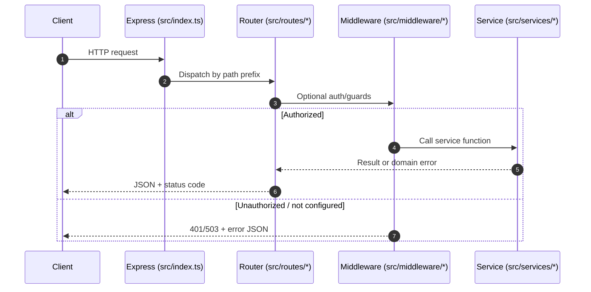
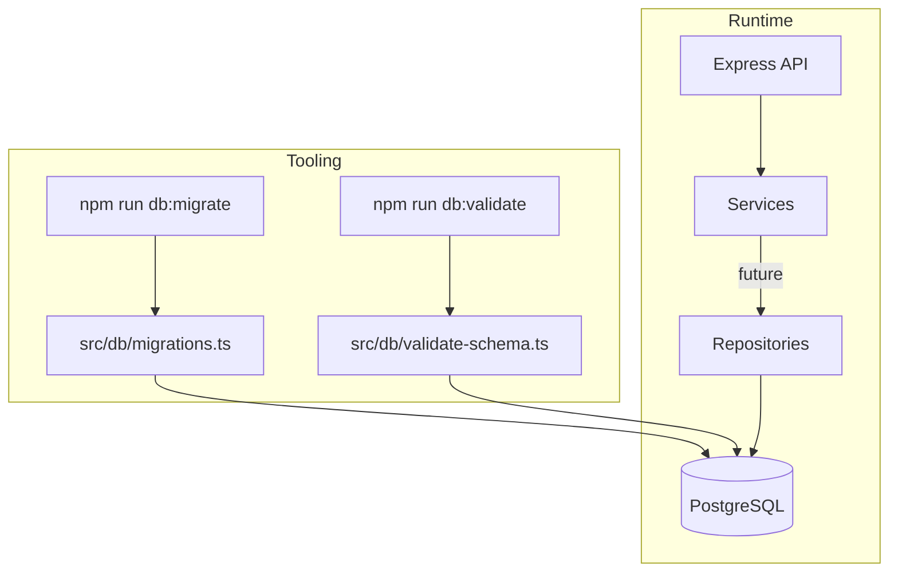

# Creditra Backend — Architecture & Module Boundaries

This document describes how the backend is structured today (routes, middleware, services, DB tooling) and the intended boundaries as the codebase grows (repositories, listeners, jobs).

## Goals

- Help new contributors find the right place to add code.
- Keep responsibilities clear (HTTP concerns vs business logic vs persistence).
- Make request flow, event flow, and data flow easy to reason about and review.

---

## High-level architecture (layers)

**Current shape (implemented):**

1. **HTTP entrypoint** (`src/index.ts`)
2. **Routing** (`src/routes/*`)
3. **Middleware** (`src/middleware/*`)
4. **Services (domain logic)** (`src/services/*`)
5. **DB tooling** (`src/db/*`) + **SQL migrations** (`migrations/*`)

**Near-term planned shape (when persistence + background work lands):**

- **Repositories** (data access; likely `src/repositories/*`)
- **Listeners** (external event ingestion; e.g. Stellar Horizon)
- **Jobs** (scheduled/background processing; interest accrual, re-evaluations)

---

## Folder structure (current)

```
src/
  index.ts                 # Express app bootstrap + mount routers
  middleware/
    adminAuth.ts           # Admin auth for privileged endpoints
  routes/
    credit.ts              # /api/credit routes (REST)
    risk.ts                # /api/risk routes (REST)
  services/
    creditService.ts       # Credit line state transitions (placeholder store)
    riskService.ts         # Risk evaluation entrypoint (placeholder)
    horizonListener.ts     # Horizon polling + event dispatch (skeleton)
  db/
    client.ts              # pg client wrapper (DATABASE_URL)
    migrations.ts          # migration runner helpers
    migrate-cli.ts         # CLI: apply pending migrations
    validate-schema.ts     # schema validation helpers
    validate-cli.ts        # CLI: migrate + validate schema
  __test__/                # API/service/middleware tests (Vitest)

docs/
  data-model.md
  security-checklist-backend.md
  backend-architecture.md  # (this document)

migrations/
  *.sql                    # sequential SQL migrations
```

---

## Module responsibilities & boundaries

### 1) `src/index.ts` (app bootstrap)

**Responsibilities**

- Create and configure the Express app (CORS, JSON parsing).
- Expose basic health endpoint (`GET /health`).
- Mount routers under stable prefixes (`/api/credit`, `/api/risk`).

**Should not contain**

- Business rules (belongs in `src/services/*`).
- Persistence logic (belongs in DB/repositories).

### 2) `src/routes/*` (HTTP routing + translation layer)

**Responsibilities**

- Define endpoint paths and HTTP verbs.
- Validate request shape at the boundary (required body fields, params).
- Call services and translate service errors into HTTP status codes.
- Apply middleware (e.g. `adminAuth`) for privileged operations.

**Patterns in this repo**

- Routes call service functions directly (`credit.ts` → `creditService.ts`).
- Domain errors are mapped to status codes:
  - `CreditLineNotFoundError` → `404`
  - `InvalidTransitionError` → `409`

**Should not contain**

- Direct DB calls (use services/repositories).
- Complex business logic (keep routes thin).

### 3) `src/middleware/*` (cross-cutting HTTP concerns)

**Responsibilities**

- Authentication/authorization.
- Request-scoped concerns (rate limits, input sanitization, correlation IDs) as they are added.

**Current implementation**

- `adminAuth.ts` enforces `X-Admin-Api-Key` (header `x-admin-api-key`) and returns:
  - `503` if `ADMIN_API_KEY` is not configured
  - `401` if key is missing/invalid

### 4) `src/services/*` (domain/business logic)

**Responsibilities**

- Encode business rules (state transitions, scoring, invariants).
- Provide a stable API that routes (and later jobs/listeners) can call.
- Throw **domain-specific errors** for expected failure cases.

**Current notes**

- `creditService.ts` uses an in-memory store (`_store`) as a placeholder for persistence.
- `riskService.ts` validates a Stellar address shape and returns placeholder results.
- `horizonListener.ts` is a skeleton poller + event dispatcher (simulated events today).

**Rules of thumb**

- Services should not depend on Express types (`Request`, `Response`).
- Prefer pure functions and explicit inputs/outputs; keep side effects isolated.

### 5) `src/db/*` + `migrations/*` (schema and migration tooling)

**Responsibilities**

- Manage PostgreSQL connectivity for tooling (`DATABASE_URL`).
- Apply SQL migrations in order and record versions in `schema_migrations`.
- Validate that the expected core tables exist (`EXPECTED_TABLES`).

**How it’s used**

- `npm run db:migrate` → `src/db/migrate-cli.ts`
- `npm run db:validate` → `src/db/validate-cli.ts` (migrate then validate)

---

## Interaction patterns

### Request flow (HTTP)



### Event flow (Horizon listener)

The intended flow is: poll Horizon → decode events → dispatch to handlers → persist → trigger downstream work.

```mermaid
flowchart LR
  H[Horizon API] -->|poll| L[src/services/horizonListener.ts]
  L --> D{dispatchEvent()}
  D --> H1[handler: persist event]
  D --> H2[handler: update credit lines]
  D --> H3[handler: enqueue jobs]
```

### Data flow (migrations + runtime)



---

## Conventions (TypeScript/Node)

- This repo is **ESM** (`"type": "module"`). When importing local TS modules, use `.js` extensions (e.g. `import { riskRouter } from "./routes/risk.js"`).
- Keep route handlers thin; enforce business rules in services.
- Prefer domain errors from services and map them to status codes in routes.
- Avoid logging secrets. Never log `ADMIN_API_KEY` or database URLs.

---

## Where to add new code

- **New endpoint**: add to `src/routes/*` and call into `src/services/*`.
- **New business rule**: add to `src/services/*` (and unit test in `src/__test__/*`).
- **DB-backed operations**: add a repository module (recommended new folder: `src/repositories/*`) and have services call it.
- **Background/scheduled work**: add a `src/jobs/*` module and keep job logic calling the same services used by HTTP routes.
- **New external event ingestion**: extend `src/services/horizonListener.ts` and add handler modules that persist/act on events.

